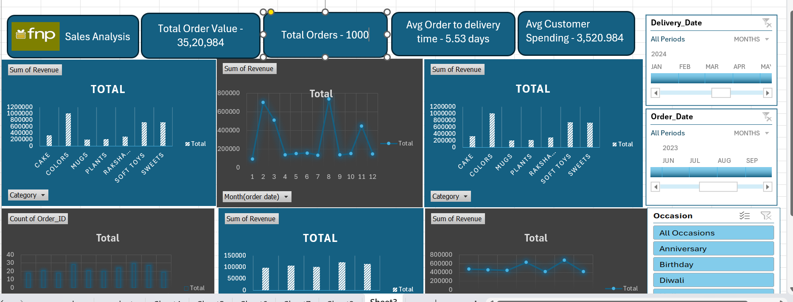
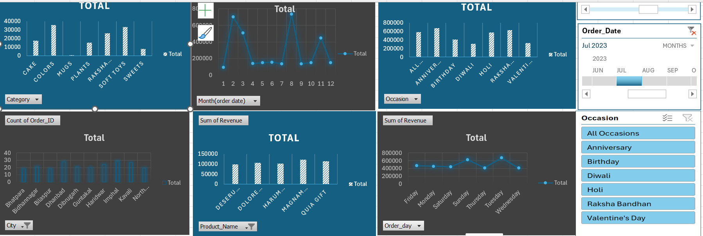
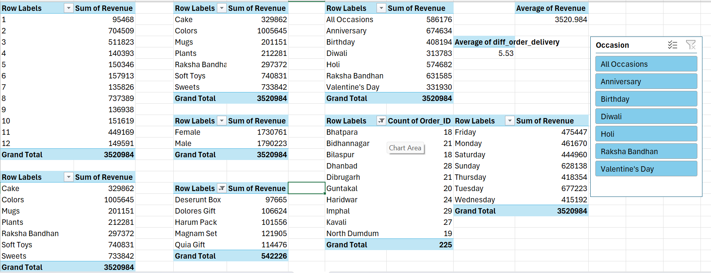
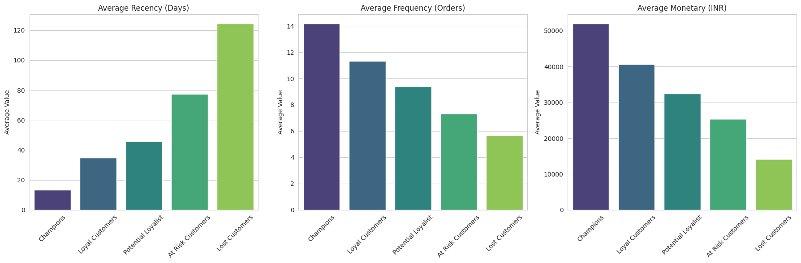
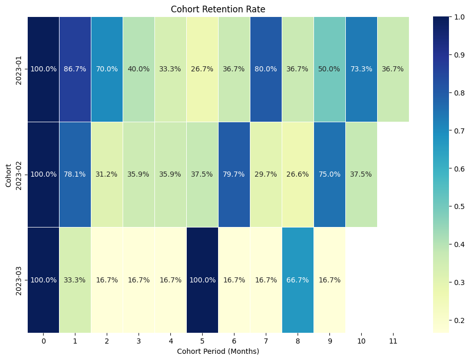

# 🌸 FNP Sales Data Analysis — End-to-End Excel & Python Project

> **An end-to-end data analysis project on Ferns and Petals (FNP) sales data. This project covers revenue trends, customer behavior, product performance, and occasion-based insights through an interactive Excel dashboard. Additionally, it delves deep into advanced customer analytics using Python for RFM (Recency, Frequency, Monetary) Segmentation and Cohort Analysis.**

---

## 📌 Project Overview

**Ferns and Petals (FNP)** is one of India's leading gifting companies, delivering gifts for occasions like Diwali, Raksha Bandhan, Holi, Valentine's Day, Birthdays, and Anniversaries.

This project analyzes FNP's internal sales dataset (`orders.csv`, `customers.csv`, `products.csv`) to answer critical business questions, present findings through a fully interactive **Excel Dashboard**, and perform advanced customer behavior modeling using **Python (Pandas, Seaborn, Matplotlib)**.

---

## 🎯 Objectives

- Identify overall revenue and key performance metrics.
- Analyze sales trends across months and occasions.
- Determine top-performing products and categories.
- Understand customer spending behavior and geographical distribution.
- Segment customers based on their purchasing habits (RFM Analysis).
- Track customer retention over time (Cohort Analysis).

---

## 🛠️ Tools & Techniques Used

| Tool / Feature | Purpose |
|---------------|---------|
| **Microsoft Excel** | Primary analysis tool for general trends |
| **Pivot Tables & Charts** | Data aggregation, grouping, and visual analysis |
| **Excel Dashboard** | Interactive slicers, KPI cards, and charts in one view |
| **Python (Jupyter Notebook)**| Advanced data manipulation and visualization |
| **Pandas** | Data cleaning, merging, and aggregation for RFM and Cohorts |
| **Seaborn & Matplotlib** | Generating heatmaps and bar charts for customer insights |

---

## 📊 Dashboard Preview

The Excel dashboard provides a high-level overview of the sales performance, allowing filtering by Occasion, Delivery Date, and Order Date.

### Key Performance Indicators (KPIs)
| KPI | Value |
|-----|-------|
| 💰 **Total Revenue** | ₹ 35,20,984 |
| 📦 **Total Orders** | 1,000 |
| 🛒 **Avg Order Value** | ₹ 3,520.98 |
| 🚚 **Avg Delivery Time** | 5.53 Days |

### Dashboard Screenshots

*Figure 1: Main Dashboard showing revenue by category, monthly trends, and orders by city.*

*Figure 2: Dashboard with active slicers filtering by specific occasions and dates.*

*Figure 3: Underlying Pivot Tables and metrics powering the dashboard.*

---

## 🔍 Advanced Customer Analytics (Python)

To gain a deeper understanding of customer behavior, two advanced analytical techniques were applied using Python: **RFM Analysis** and **Cohort Analysis**.

### 1. RFM Analysis (Recency, Frequency, Monetary)

**RFM Analysis** is a customer segmentation technique that uses past purchase behavior to divide customers into groups.
- **Recency (R):** How many days ago was their last purchase? (Lower is better)
- **Frequency (F):** How many times has the customer purchased? (Higher is better)
- **Monetary (M):** How much total money has the customer spent? (Higher is better)

#### Implementation Steps:
1. Calculated R, F, and M values for each customer.
2. Assigned scores from 1 to 5 for each metric using quintiles (`pd.qcut`).
3. Combined the scores to create an overall RFM Score.
4. Segmented customers into actionable groups based on their total score:
   - **Champions:** Bought recently, buy often, and spend the most.
   - **Loyal Customers:** Spend good money and often.
   - **Potential Loyalist:** Recent customers, but spent a good amount and bought more than once.
   - **At Risk Customers:** Spent big money and purchased often but a long time ago.
   - **Lost Customers:** Lowest recency, frequency, and monetary scores.

#### Visualization:

*Figure 4: Average Recency, Frequency, and Monetary values across different customer segments. Notice how 'Champions' have the lowest recency (purchased recently) but the highest frequency and monetary values.*

### 2. Cohort Analysis (Customer Retention)

**Cohort Analysis** tracks specific groups of users (cohorts) over time to observe their retention rate. A cohort was defined as a group of customers who made their first purchase in the same month.

#### Implementation Steps:
1. Identified the **First Order Date** for each customer to define their Cohort Month.
2. Calculated the **Cohort Period** (number of months since the first purchase) for every subsequent order.
3. Aggregated the number of unique active customers for each Cohort and Cohort Period.
4. Calculated the **Retention Rate** by dividing active customers in subsequent periods by the initial cohort size.

#### Visualization & Interpretation:

*Figure 5: Cohort Retention Rate Heatmap. The rows represent the acquisition month (Cohort), and the columns represent the months elapsed since the first purchase. The color intensity and percentages show how well customers are retained over time.*

**How to read the heatmap:**
- **Row '2023-01', Column '1':** 86.7% of customers who made their first purchase in January 2023 returned to make another purchase in the following month (February).
- **Trends:** By looking across a row, we can see the drop-off rate of customers. By looking down a column, we can compare if newer cohorts (e.g., March) are retaining better than older cohorts (e.g., January) at the same lifecycle stage.

---

## ❓ Business Questions Answered

| # | Question | Key Finding |
|---|----------|-------------|
| 1 | Total Revenue | ₹ 35,20,984 across all orders |
| 2 | Avg Order & Delivery Time | 5.53 days average delivery |
| 3 | Monthly Sales Performance | Feb & Aug are peak months |
| 4 | Top Products by Revenue | Colors (₹10,05,645) leads |
| 5 | Customer Spending Analysis | ₹3,520.98 average spend |
| 6 | Top 5 Products Sales | Magnam Set tops at ₹1,21,905 |
| 7 | Top 10 Cities by Orders | Imphal (29), Dhanbad (28) |
| 8 | Order Quantity vs Delivery Time | No major correlation found |
| 9 | Revenue by Occasion | Anniversary leads (₹6,74,634) |
| 10 | Product Popularity by Occasion | Colors → Holi, Cake → Birthday |

---

## 💡 Key Insights & Recommendations

1. **Focus on Top Categories:** **Colors**, **Soft Toys**, and **Sweets** together account for **70%+ of total revenue**. Stock up on these items, especially before peak seasons.
2. **Capitalize on Peak Months:** **February** (Valentine's Day) and **August** (Raksha Bandhan) are the strongest sales months. Marketing budgets should be optimized for these periods.
3. **Untapped Potential in Tier-2 Cities:** Cities like Imphal, Dhanbad, and Kavali show surprisingly high order volumes. Expand targeted advertising and improve logistics in these regions.
4. **Occasion-Specific Bundling:** Anniversaries drive the highest revenue (₹6,74,634). Create high-value "Anniversary Bundles". Similarly, promote "Holi Color Kits" or "Diwali Sweet Hampers".
5. **Campaign Optimization:** Diwali currently underperforms relative to its cultural significance. This is a massive growth opportunity requiring a revamp in promotional strategies.
6. **Customer Retention:** Use the RFM segments to launch targeted email campaigns. Reward "Champions" with loyalty programs and send "We Miss You" discounts to "At Risk Customers" to improve retention rates seen in the Cohort Analysis.

---

## 🚀 Skills Demonstrated

`Microsoft Excel` `Pivot Tables` `Data Visualization` `Dashboard Design`  
`Python` `Pandas` `Seaborn` `Matplotlib`  
`RFM Segmentation` `Cohort Analysis` `Customer Retention` `Business Analytics`

---

## 👤 Author

**[Himanshu Singh]**  
📧 [himanshu.iiitu2027@gmail.com]   
💻 [GitHub Profile](https://github.com/Himanshu0518)
